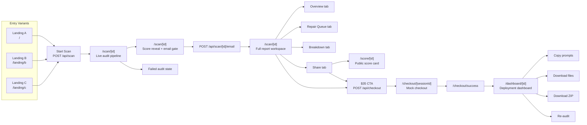
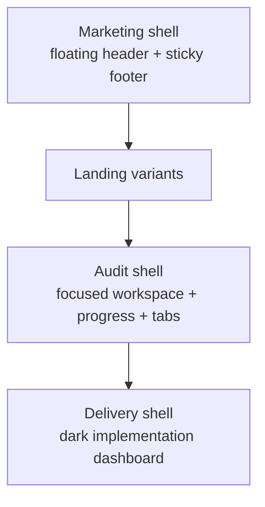

# AISO UI / UX Flow

Snapshot date: March 12, 2026

## Overview

AISO is currently a scan-to-report-to-paid-implementation funnel.

The product has three public landing variants, one core scan/report route, one public share route, one mock checkout path, and one paid deployment dashboard. The biggest UX pivot happens on `/scan/[id]`, which acts as the live pipeline, the gated reveal, the full report workspace, and the conversion bridge into checkout.

## Visual Flow

## Shell Map

## User Journey

### 1. Entry and qualification

Routes:
- `/`
- `/landing/b`
- `/landing/c`

Purpose:
- Explain the offer
- Build trust
- Get a URL into the funnel

Shared UX characteristics:
- URL input as the primary action
- Educational sections that explain AI visibility, scoring, and deliverables
- Repeated CTA structure
- Marketing navigation and footer chrome

Current notes:
- The three variants use different visual styles but all route to the same scan flow
- Header links to `/login` and `/audit`, which do not currently exist
- Header anchors reference `#how-it-works`, `#pricing`, and `#resources`, but those section ids are not currently defined

### 2. Scan creation and live audit

Route:
- `/scan/[id]`

Purpose:
- Turn the URL into a visible system process
- Show progress and reduce uncertainty
- Establish credibility before the reveal

Visible states:
1. Loading
2. Live pipeline
3. Failed audit
4. Completed score reveal
5. Unlocked full report

Key UI behaviors:
- Polling for scan progress
- Checklist-based crawl/scoring progress
- Re-audit action
- Visit-site action

### 3. Score reveal and email gate

Route:
- `/scan/[id]` after completion, before email unlock

Purpose:
- Give immediate value
- Hold back the detailed repair blueprint
- Capture contact info before revealing the full report

What the user sees:
- Score ring
- Score band
- Limited framing around what will be unlocked
- Email form

What happens next:
- `POST /api/scan/[id]/email`
- Full report is loaded from `GET /api/scan/[id]/report`

### 4. Full report workspace

Route:
- `/scan/[id]`

Purpose:
- Turn the audit into a navigable workspace
- Prioritize action
- Create momentum toward purchase

Tabs:
- `Overview`
- `Repair Queue`
- `Breakdown`
- `Share`

Tab details:

#### Overview
- Top-line stats
- Potential lift
- Web Health summary
- Copyable implementation brief

#### Repair Queue
- Ranked fixes by ROI
- AI and Web Health issues in one list
- Per-fix copy prompt actions

#### Breakdown
- Expandable cards for the six AI visibility dimensions
- Expandable cards for Web Health pillars

#### Share
- Share link for the public score card
- X and LinkedIn share actions
- Conversion CTA into checkout

### 5. Public sharing

Route:
- `/score/[id]`

Purpose:
- Give teams and stakeholders a lightweight public-facing score summary

What it includes:
- Domain
- Score
- Band
- Completion date
- CTA back to the main audit flow

What it does not include:
- Full report
- Fix queue
- Paid dashboard

### 6. Conversion

Routes:
- `/checkout/[id]`
- `/checkout/success`

Purpose:
- Convert a report viewer into a paid user
- Bridge into file delivery

Current behavior:
- Checkout is mocked
- “Simulate Payment” marks the session as paid
- Success page routes the user into the dashboard

### 7. Deployment dashboard

Route:
- `/dashboard/[id]`

Purpose:
- Deliver the actual implementation package
- Reduce friction for deployment
- Make the app feel operational, not just diagnostic

Primary elements:
- File list
- File-by-file install guidance
- Verification URLs
- Copy file
- Download file
- Copy prompt for Cursor
- Copy all prompts
- Copy audit brief
- Download ZIP archive
- Re-audit

Delivered files:
- `llms.txt`
- `robots.txt`
- `organization-schema.json`
- `sitemap.xml`

## Route Inventory

### Acquisition
- `/`
- `/landing/b`
- `/landing/c`
- `/styleguide/landing-mockups`

### Audit
- `/scan/[id]`
- `/api/scan`
- `/api/scan/[id]`
- `/api/scan/[id]/email`
- `/api/scan/[id]/report`

### Share
- `/score/[id]`
- `/score/[id]/opengraph-image`

### Conversion
- `/checkout/[id]`
- `/checkout/success`
- `/api/checkout`
- `/api/checkout/verify`

### Delivery
- `/dashboard/[id]`
- `/api/scan/[id]/files`
- `/api/scan/[id]/files/archive`

### Utility / supporting pages
- `/terms`
- `/privacy`
- `/404`
- `/styleguide`

## Structural Product Pattern

The app currently follows this product pattern:

1. Marketing promise
2. Fast diagnostic
3. Gated deeper insight
4. Paid implementation package
5. Delivery workspace

That means the product is not just “a scanner.” It is a funnel product with a diagnostic front half and an operational handoff back half.

## Current UX Gaps

- Landing header links point to routes that do not exist: `/login` and `/audit`
- Header anchor links reference sections that are not defined
- Most footer/social/company/resource links are placeholders
- The three landing variants disagree on which one is labeled current
- Checkout is mock-only
- Scan/file persistence is in-memory, so data can reset on app restart

## Recommended Use Of This Doc

Use this document when you need:
- a stakeholder walkthrough
- a product planning reference
- a baseline for UX cleanup
- a source for turning the current flow into a polished deck or PDF
